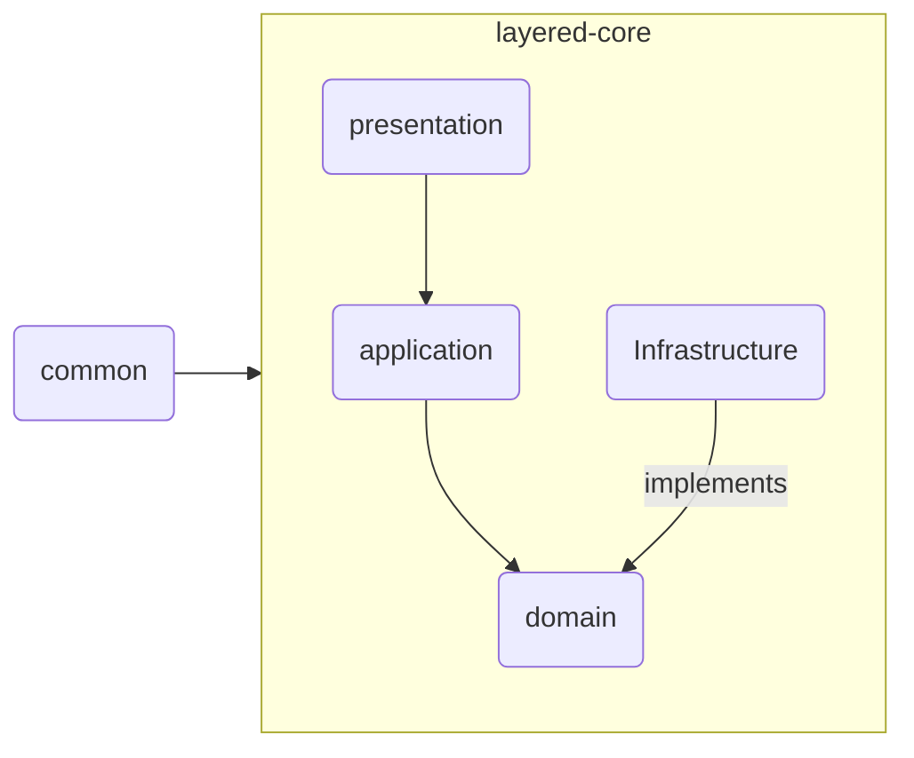

# 프로젝트 정책

## 1. 코드 스타일 가이드

Kotlin 코드 스타일은 [Kotlin Coding Conventions](https://kotlinlang.org/docs/coding-conventions.html)을 따릅니다.

## 2. 커밋 메시지 규칙

커밋 메시지는 [Conventional Commits](https://www.conventionalcommits.org/en/v1.0.0/)를 따릅니다.

## 3. 예외 처리 정책

RuntimeException을 상속받는 커스텀 예외를 사용합니다. message는 커스텀 예외 내부에서 정의하며, 필요에 따라 생성자를 추가합니다.

예시:

```kotlin
class UrlNotFoundException(
    message: String = "URL을 찾을 수 없습니다."
) : RuntimeException(message)
```

## 4. 라이브러리 사용 정책

- 선택근거를 명시하고 사용하여야 합니다.

## 5. Dockerfile 실행 방법

1. Docker 이미지를 빌드

```shell
docker build -t url-shortener .
```

2. Docker 컨테이너를 실행

e.g., 1 core, 1GB memory

```shell
docker run -d --name url-shortener --memory="1g" --cpus="1.0" -p 8080:8080 url-shortener:latest
```

## 6. JMeter를 사용한 트래픽 테스트 방법

```shell
jmeter -t performance/test_plan.jmx
```

## 7. 프로제그 layer 구조

- `presentation`: API 요청을 받아 처리하는 계층
- `application`: 비즈니스 로직을 처리하는 계층
- `domain`: 비즈니스 로직을 정의하는 계층
- `infrastructure`: 데이터베이스, 외부 API 등과의 연동을 처리하는 계층
- `common`: 공통으로 사용되는 코드를 정의하는 계층



> [!Warning]
> 계층형 아키텍처를 사용하기 때문에 하위 레이어가 상위 레이어에 의존하면 안됩니다.
> 즉, 의존성 흐름은 항상 아래에서 위로 향해야 합니다.
